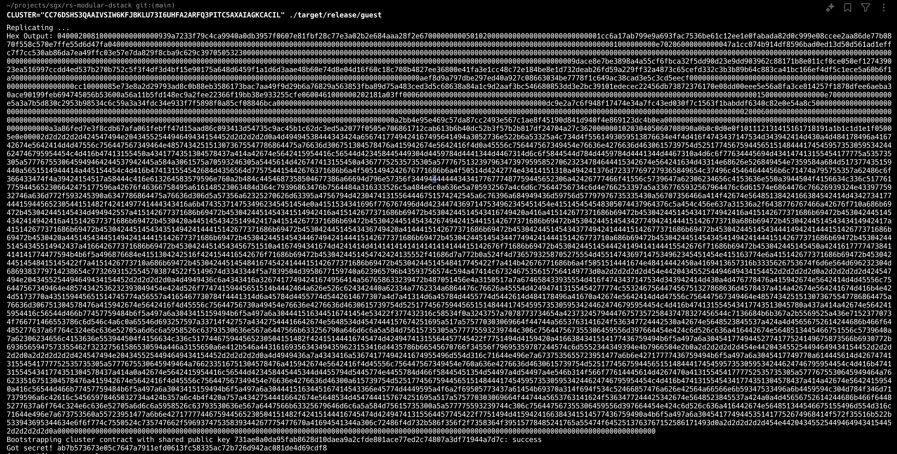

# NY Starter

This is a minimal implementation of a dstack network using the Stellar blockchain as comms layer.

> NOTE: This version is purpusefully **unsafe** because it doesn't require having a TDX compatible machine and does not perform important checks on quote verification.

(There are some sparse comments in the codebase commenting about security and other codebase design stuff)

## Get Started

### On bootstrapper node.

1. Build new-york (cargo build --release within the directory).
2. Generate a stellar keypair and fund it on testnet.
3. Build and deploy the `contracts/stellar/simple-cluster` contract.
4. Run the host script: `CLUSTER="JUST_DEPLOYED" SECRET="STELLAR_SECRET" ./target/release/host`.
5. Run the guest script: `CLUSTER="JUST_DEPLOYED" ./target/release/guest`

This will bootsrap the cluster contract on-chain and derive a shared secret on the guest side:

### On other nodes.

0. Do steps 1 and 2 of bootstrapper.
1. Get the shared public key (from bootsrapper node or chain). 
2. Run the host script: `CLUSTER="JUST_DEPLOYED" SECRET="STELLAR_SECRET" ./target/release/host`.
3. Run the guest script: `PUBKEY="SHARED_PUBKEY" CLUSTER="JUST_DEPLOYED" ./target/release/guest`.

You'll see the new node asking to be registered on-chain and bootstrapped node encryting the secret and posting it onchain allowing the new node to derive it.
